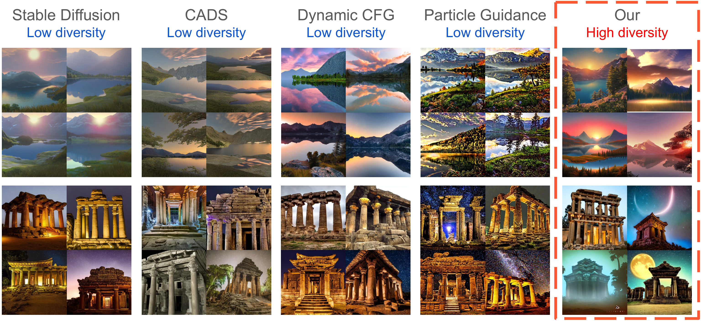
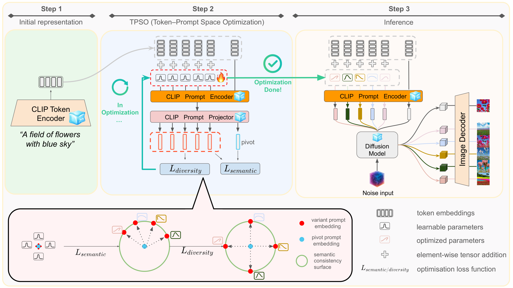

# TPSO

Official implementation of **TPSO: Training-Free Diverse Image Generation via
Semantic Prompt Embedding Optimization** (IJCNN 2026).

[](https://arxiv.org/abs/2511.19811)
[](LICENSE)

TPSO increases the diversity of text-to-image generation without training or
modifying diffusion-model weights. Before denoising, it optimizes small offsets
added to the CLIP token embeddings. A semantic constraint keeps each optimized
embedding close to the original prompt, while a diversity loss encourages the
variants of that prompt to differ from one another. During denoising, TPSO
gradually returns to the original prompt embedding to preserve image quality.

<p align="center">
  
</p>

<p align="center">
  
</p>

## Supported Models

| CLI name | Backbone | Generation resolution | Default lambda |
| --- | --- | ---: | ---: |
| `sd15` | Stable Diffusion 1.5 | 512 | 1 |
| `sd21` | Stable Diffusion 2.1 | 768 | 1 |
| `sd35` | Stable Diffusion 3.5 Medium | 512 | 10 |

`lambda` is the weight of the diversity loss. For SD3.5, TPSO optimizes the two
CLIP encoders independently and leaves the T5 representation unchanged.

## Installation

Image generation requires Python 3.10 or newer and a CUDA-capable GPU.

```bash
git clone https://github.com/Open-Debin/TPSO.git
cd TPSO
python -m venv .venv
source .venv/bin/activate
python -m pip install --upgrade pip
python -m pip install -r requirements.txt
python -m pip install -e . --no-deps
```

Conda installation:

```bash
conda env create -f environment.yml
conda activate tpso
python -m pip install -e . --no-deps
```

Accept the required model licenses on Hugging Face, then authenticate if the
selected model is gated:

```bash
hf auth login
```

## Generate Images

The following command generates four SD1.5 images from one prompt:

```bash
tpso-generate \
  --model sd15 \
  --prompt "A photograph of a red panda in a bamboo forest" \
  --num-images 4 \
  --output-dir outputs/red-panda
```

`--model` accepts `sd15`, `sd21`, or `sd35`. `--num-images 4` produces four
variants of this prompt. They are saved in `outputs/red-panda` as:

```text
outputs/red-panda/
|-- 0_0.jpg
|-- 0_1.jpg
|-- 0_2.jpg
`-- 0_3.jpg
```

The first number is the prompt index and the second is the variant index. To
generate images for several prompts, repeat `--prompt` once for each prompt:

```bash
tpso-generate \
  --model sd15 \
  --prompt "A red panda in a bamboo forest" \
  --prompt "A wooden chair beside a window" \
  --num-images 4 \
  --output-dir outputs/two-prompts
```

The first prompt is saved as `0_0.jpg` through `0_3.jpg`. The second prompt is
saved as `1_0.jpg` through `1_3.jpg`. This is the same naming convention used
by the paper benchmarks.

The model and precomputed unconditional context are downloaded on first use and
then loaded from the local cache. Pass `--overwrite` to replace existing output
images.

YAML configurations are available in `configs/`. Command-line values override
the corresponding YAML values:

```bash
tpso-generate \
  --config configs/sd15.yaml \
  --prompt "A wooden chair" \
  --kappa 0.8 \
  --output-dir outputs/chair
```

## Unconditional Context

The conditional embedding depends on the prompt and is optimized for each
generation. The unconditional embedding is prompt-independent, so it can be
precomputed and reused.

The matching context is downloaded from
[PonyMeng/TPSO](https://huggingface.co/PonyMeng/TPSO) and verified
automatically. Use `--rebuild-unconditional` only when you want to recompute it
locally:

```bash
tpso-generate \
  --model sd15 \
  --prompt "A wooden chair" \
  --rebuild-unconditional \
  --output-dir outputs/chair-rebuilt
```

## Generate From 1,000 Prompts

The paper experiments use `coco_30k_randomly_sampled_2014_val.csv`. The file has
two columns:

```csv
file_name,caption
COCO_val2014_000000054123.jpg,A group of zebras grazing in the grass.
COCO_val2014_000000012897.jpg,a number of people standing around a large group of luggage bags
```

The referenced COCO images are not required. `caption` provides the generation
prompt, while `file_name` is retained as source metadata.

The following command reads the first 1,000 rows and generates 10 variants for
each prompt with SD1.5:

```bash
tpso-benchmark \
  --group table1 \
  --experiment sd15 \
  --limit-prompts 1000 \
  --prompts-csv /path/to/coco_30k_randomly_sampled_2014_val.csv \
  --output-root outputs/coco-1k
```

`--group table1` selects the main-comparison presets, and `--experiment sd15`
selects only the SD1.5 row from that group. `--limit-prompts 1000` restricts the
run to the first 1,000 captions. Replace `sd15` with `sd21` or `sd35` to use a
different backbone.

The result directory contains 10,000 images named
`{prompt_id}_{variant_id}.jpg`, together with `prompts.csv` and `manifest.json`.
The manifest records the settings used for that run. If generation is
interrupted, rerunning the same command skips completed batches and continues
the experiment. If you change the model, prompt count, seed, or batch size, use
a new `--output-root` so results from different settings are not mixed.

See [the method-to-code map](docs/method.md) for implementation details and
[paper benchmark generation](docs/paper-benchmarks.md) for Tables I-V.

## Citation

```bibtex
@inproceedings{meng2026tpso,
  title     = {TPSO: Training-Free Diverse Image Generation via Semantic Prompt Embedding Optimization},
  author    = {Meng, Debin and Jin, Chen and Gao, Zheng and Li, Yanran and Patras, Ioannis and Tzimiropoulos, Georgios},
  booktitle = {International Joint Conference on Neural Networks},
  year      = {2026}
}
```

## License

Code is released under the [Apache License 2.0](LICENSE). Model weights retain
their original licenses.
